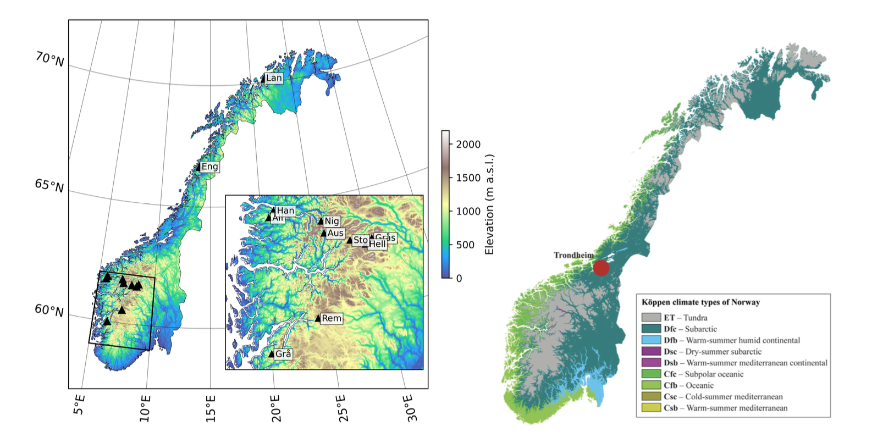
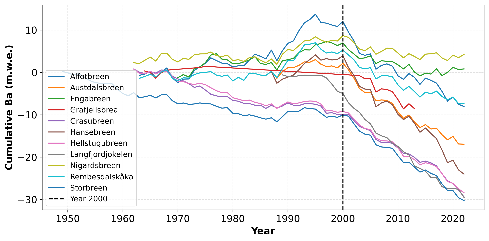
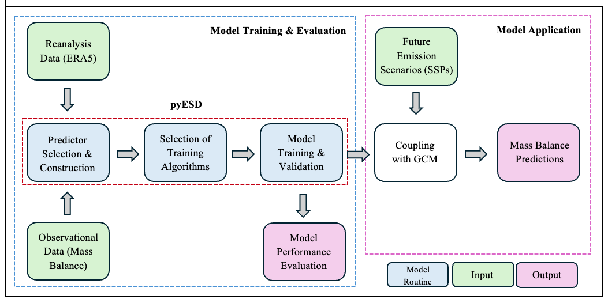

# Glacier-pyESD

- Repository to house python scripts pertaining to Danish's Master thesis project.
- As a master's candidate pursuing an International Master's degree in Marine Environment (with a focus on oceanography), Danish conducted his master thesis research at the University of Glasgow, School of Geographical and Earth Sciences.
- The thesis was conducted under the supervision of Dr. rer. nat. habil. Sebastian G. Mutz; as part of his research cluster– [Climate Dynamics Lab](https://mutz.science/).

## Project Overview

The thesis investigates the hypothesized **regime shift in the climatic controls on Norwegian glaciers around the year 2000**, analyzing 11 glaciers spanning 57–72°N across Norway's maritime-to-continental gradient (Ålfotbreen, Austdalsbreen, Engabreen, Gråsubreen, Grafjellsbrea, Hansebreen, Hellstugubreen, Langfjordjøkelen, Nigardsbreen, Rembesdalskåka, Storbreen).

  

  

## Methodology

- Correlation analysis (pre-/post-2000) using DJF (accumulation) and MJJAS (ablation) seasonal windows.
- Predictors from ERA5 reanalysis (t2m, precipitation, 10m wind, SSRD, MSL) plus teleconnection indices (NAO, EA, AO) derived via EOF/PCA of MSL.
- Empirical–statistical downscaling (customized pyESD, Perfect Prognosis design) linking ERA5 predictors to NVE glacier mass-balance records.
- Predictor selection: Recursive, Tree-based, Sequential.
- Six regressors: RidgeCV, Bayesian Ridge, ARD (linear); Random Forest, Bagging, XGBoost (non-linear).
- Model ensembling via Stacking or Voting, with cross-validation.
- Coupled with CMIP6 (MPI-ESM1-2-LR) to project Ba/Bw/Bs under SSP1-2.6, SSP2-4.5, SSP5-8.5.
- Glacier dynamics, climate–glacier feedbacks, and evolving hypsometry are not represented; projections should be interpreted with this caveat.

  

## Key Findings

**Climatic controls and the post-2000 regime shift**
- NAO is the dominant driver of winter climate/mass-balance variability (NAO–Pacc r=0.62); its extreme positive phase (1980s–early 1990s) drove warm, wet winters.
- Post-2000 mass loss is the most negative on record, linked to rising Tabl and a weaker/negative NAO; Bw–NAO correlation weakens for 7/11 glaciers.
- Rising post-2000 correlations of Bs with Pabl, Tabl, and SSRD, plus stronger Ba–Tabl correlation across all 11 glaciers, point to a shift toward an energy (ablation)-dominated regime.
- Maritime–continental gradient persists: Nigardsbreen (maritime) shows stronger Ba–Pacc (r=0.66) and Ba–NAO (r=0.45) correlations than continental Hellstugubreen (r=0.48, r=0.39). Pre-2000 Pacc correlations are consistently higher for maritime glaciers (Ålfotbreen r=0.81, Austdalsbreen r=0.89, Hansebreen r=0.84) than continental ones (Hellstugubreen r=0.64, Gråsubreen r=0.44).

**Model performance**
- Skill ranks **Bw > Ba > Bs**: Bw (mean R²≈0.45, RMSE≈0.59 m w.e.), Ba (mean R²≈0.55, RMSE≈0.64 m w.e.), Bs (mean R²≈0.28, RMSE≈0.90 m w.e.).
- Linear regressors (Ridge, Bayesian Ridge, ARD) consistently outperform non-linear ones (Bagging, RF, XGBoost).
- Maritime glaciers outperform continental glaciers, consistent with Mutz et al. (2016).
- Sparse training data hurts performance (e.g. Grafjellsbrea, 7 years, RMSE>1.0).
- Performance is comparable to similar ESD studies (Austria: Schöner and Böhm, 2007; Norway: Mutz et al., 2016; Andes: Mutz and Aschauer, 2022), generally exceeding the Andes models due to a larger training dataset.

**CMIP6-coupled projections (MPI-ESM1-2-LR; SSP1-2.6/2-4.5/5-8.5)**
- Nigardsbreen and Engabreen sustain mass through 2100; Ålfotbreen and Rembesdalskåka show little net change; the remaining 7 glaciers lose mass (≈−25 m w.e. for Hellstugubreen to over −60 m w.e. for Langfjordjøkelen).
- Differences across SSP scenarios are modest.
- Nigardsbreen (46.6 km²) and Engabreen (36.02 km²) are among Norway's largest outlet glaciers (Andreassen and Winsvold, 2012); both still show terminus retreat despite projected mass stability.
- Langfjordjøkelen's steep loss reflects its narrow, low-lying range (302–1050 m a.s.l.) and rapidly warming Arctic setting (Andreassen et al., 2012).
- Broadly aligns with Mutz et al. (2016), except more positive outcomes for Nigardsbreen and Ålfotbreen — attributed to training data, methodology, and CMIP6 vs. CMIP3 (MPI-ESM1-2-LR's revised physics; Mauritsen et al., 2019).
- Glacier dynamics, feedbacks, and evolving hypsometry are not modeled; projections should be read with this caveat.
- 
## Source Code Modifications

Changes were made to pyESD's source code to adapt it for glacier applications:
- Recognizing mass-balance variables (Ba, Bw, Bs) as valid predictands
- Incorporating a `YearlyStandardizer` to handle the annual resolution of glacier mass-balance measurements
- Additional adjustments to support CMIP6-coupled projection workflows
