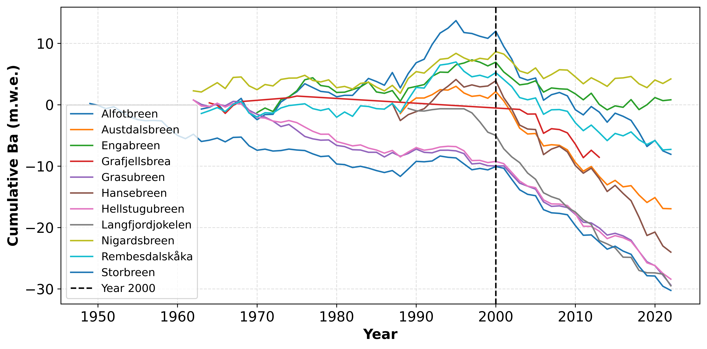
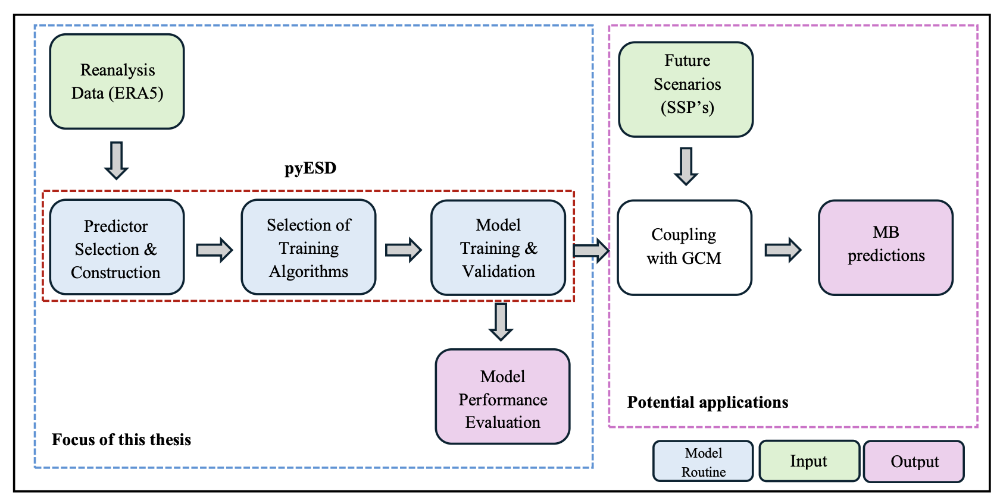

# Glacier-pyESD

- Repository to house python scripts pertaining to Danish's Master thesis project.
- As a master's candidate pursuing an International Master's degree in Marine Environment (with a focus on oceanography), Danish conducted his master thesis research at the University of Glasgow, School of Geographical and    Earth Sciences.
- The thesis was conducted under the supervision of Dr. rer. nat. habil. Sebastian G. Mutz; as part of his research cluster– [Climate Dynamics Lab](https://mutz.science/).

- The thesis project investigates the hypothesized "Regime Shift in the Climatic Controls on Norwegian Glaciers around the year 2000."

  

- This work applies empirical–statistical downscaling (ESD) using a customized pyESD framework. It combines glacier mass-balance observations with ERA5 and CMIP6 predictors through regional and teleconnection indices (e.g.,   NAO, EA, SCAN), advanced predictor selection (recursive, tree-based, sequential), and multiple machine-learning regressors (e.g. Ridge, ARD, RandomForest). Models were trained, cross-validated, and ensembled Stacking/Voting) to simulate historical variability and project future Ba/Bw/Bs anomalies under SSP1-2.6, SSP2-4.5, and SSP5-8.5.

  

- Changes made to pyESD's source code: some changes were made in order to make pyESD work with glacier data, recognise mass balance variables (ba, bs, bw), incoporated a 'YearlyStandardizer' to work with the annual resolution of glacier mass balance measurements, etc.
